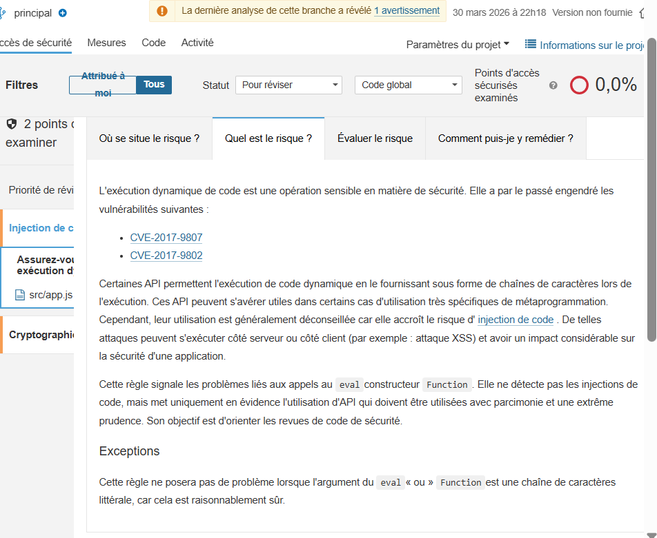
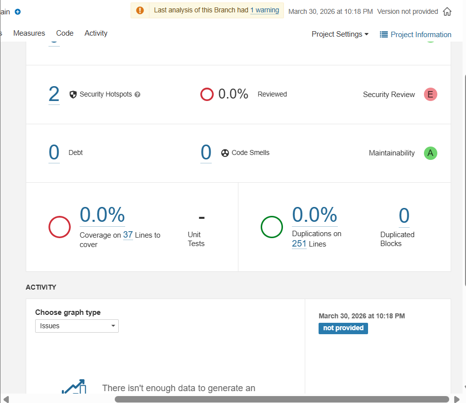
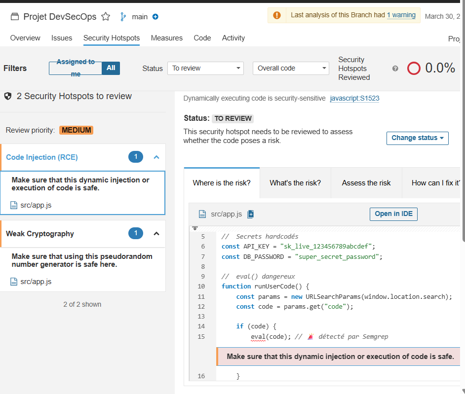

# Projet DevSecOps - Analyse SonarQube

## Objectif

Réaliser une analyse SAST avec SonarQube sur une application Node.js dans le cadre d’un projet DevSecOps.

---

## Résultats

### Dashboard SonarQube

---

### Security Hotspots

---

### Quality Gate

---

## Analyse détaillée

Voir :

analysis/sonarqube.md

---

## Conclusion

SonarQube permet une analyse globale de la qualité du code et identifie des zones sensibles via les Security Hotspots.  
Cependant, il doit être combiné avec d’autres outils comme Semgrep et CodeQL pour une détection complète des vulnérabilités.